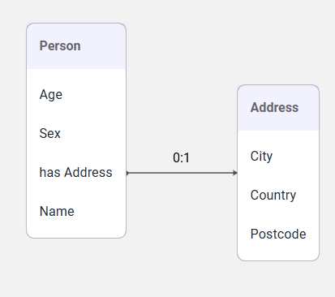

# Excel Template for SHACL

This repository contains an Excel template you can use to create SHACL structures. It is based on the open-source project [xls2rdf](https://xls2rdf.sparna.fr/rest/doc.html), developed by [Sparna](https://www.sparna.fr/en/).

## How to Use the Template

1. **Download the template file**  
2. **Fill in the Excel file**  
3. **Convert the Excel into SHACL using xls2rdf**  

The converter is available in multiple formats: online API, command-line app, Java library, and a user-friendly [online form](https://xls2rdf.sparna.fr/rest/doc.html):

- Upload your Excel file  
- Check the box "Ignore SKOS post-processings"  
- Click "Convert" and download the resulting SHACL file

## Template file structure
The files has three sheets.

- The first sheet (named "prefixes") defines the prefixes necessary for the structure. Here you have to state the datasetIdentifier that will be attached to the structure. This identifier will then be used to build the I14Y PREFIX. 

- The second sheet (named "NodeShapes (classes)") defines the classes of the structure. Here you can state the URI, the label of the class, and other properties. If you want you can add other properties: add a column and in row 8 add the property URI (for example skos:notation). If you don't want to use a column you can leave it empty. 
- The third sheet (named "PropertyShapes (properties)") defines the attributes and associations of each class. 
    - If it is an association: you need to link the association to the class via sh:node (in column U). To do so, you state the correct URI of the class (that has been defined in sheet 2). For example: i14y:Address. 
    - if it is an attribute: you can define the datatype, other constraints (pattern, maxLength, minLength, ...) and you can associate a I14Y Concept in the field dcterms:confromsTo. 

The template `template_shacl_i14y.xlsx` provide a simple example (Person, Address) to understand how it works. 

The turtle file `template_shacl_i14y.ttl` is the output obtained by the [online form](https://xls2rdf.sparna.fr/rest/doc.html).

The following screenshot shows how this simple stracture can be then visualized in I14Y: 

## Acknowledgements and License
This project includes material from the [xls2rdf GitHub repository](https://github.com/sparna-git/xls2rdf?tab=readme-ov-file) licensed under LGPL-3.0. Any modifications or additions in this repository are in accordance with that license.
The excel template has been downloaded from [SHACL play](https://shacl-play.sparna.fr/play/shaclexcel) and it has been slightly modified to meet I14Y needs. 

